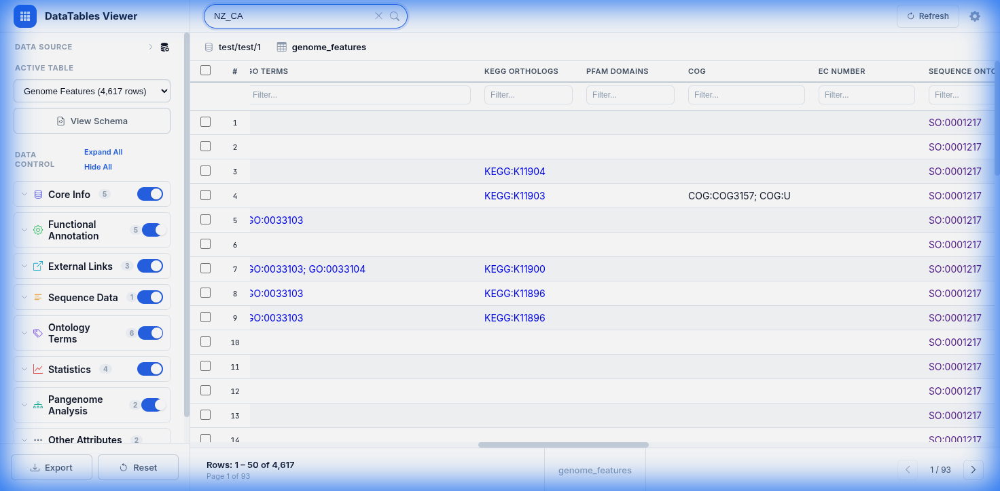
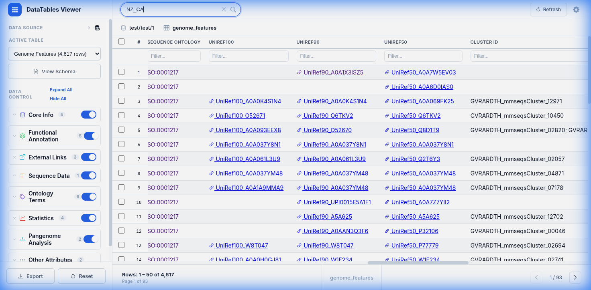
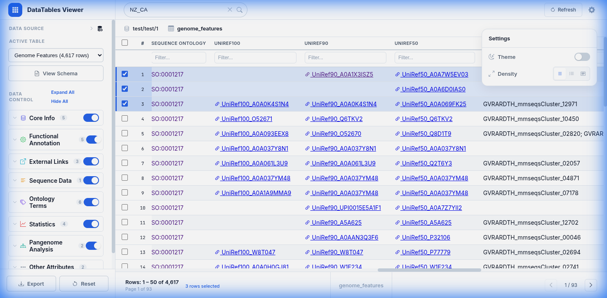

# DataTables Viewer - Local SQLite Demo (test/test/1)

This document demonstrates the functionality of the DataTables Viewer when connected to the local BERDL SQLite database (`data/berdl_tables.db`) using the in-browser **sql.js** engine.

## 1. Local Database Connection
The viewer connects to the local `.db` file directly. You can see the actual row counts for all tables in the sidebar.

- **Genome Features**: 4,617 rows
- **Pangenome Features**: 165,496 rows
- **Genomes**: 42 rows

## 2. Advanced Filtering & Search
The global search bar performs real-time queries against the local SQLite database. Below shows the results filtered for `NZ_CA`.

## 3. Data Transformers & Interactive Links
The viewer uses sequential transformers to clean and link data:
- **UniRef Links**: The `UniRef:` prefix is removed, and values are converted to interactive UniProt links.
- **Ontology Terms**: GO terms are linked to the AmiGO database.

## 4. UI Features
The viewer supports:
- **Theme Toggling**: Seamless switching between Light and Dark modes.
- **Row Selection**: Select rows for export or detailed analysis.
- **Pagination**: Efficiently browse thousands of records with pagination (showing 50 rows per page).

